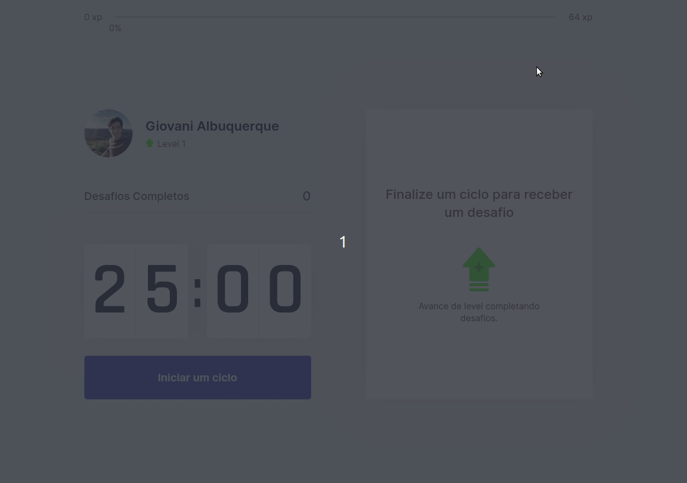
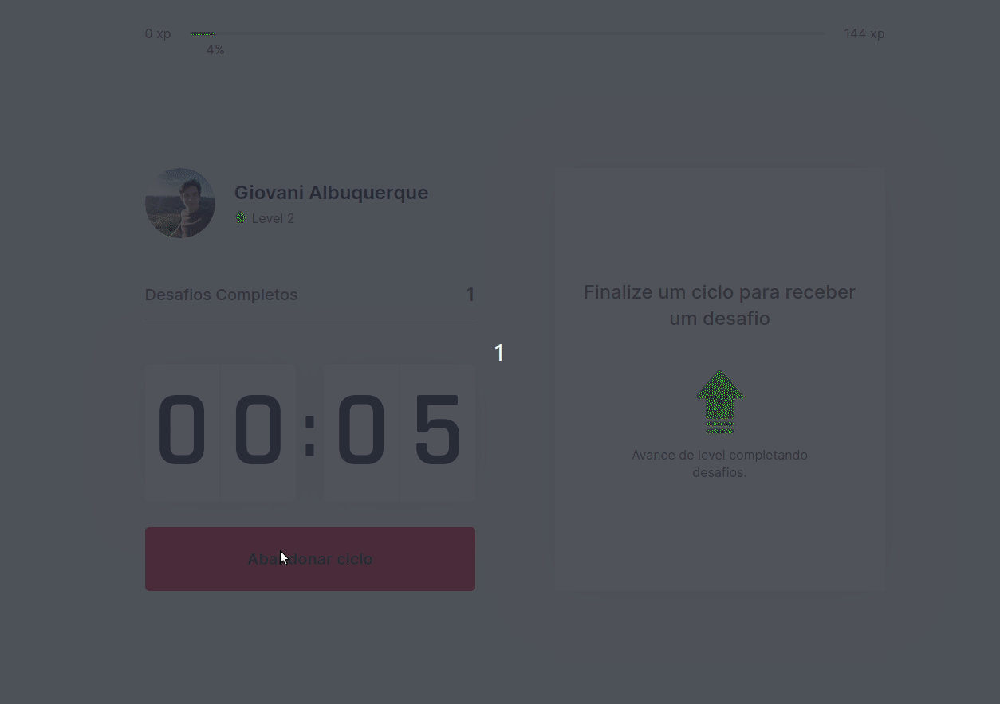
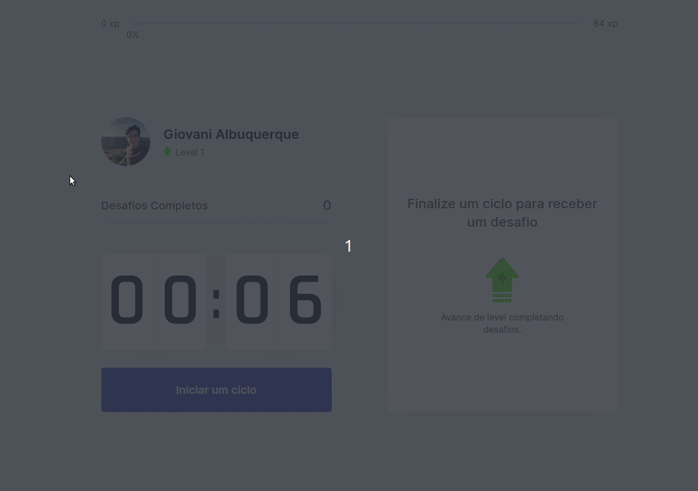

<h1 align="center">
  <a href="https://moveit-brown-phi.vercel.app/">
    
  </a>
</h1>

<p align="center">Move.it is a project created by Rocketseat initially to be a platform that combines the technique of pomodoro, which consists of alternating cycles of focus and rest, with exercises for well-being for those who spend many hours in front of a computer, which can be harmful to health when you do no exercise or take periods of rest!</p>

<p align="center">
  <a href="https://github.com/Giovaniavs">
    
  </a>

  

  

  
</p>

---
<br>

- [Mockup](https://www.figma.com/file/vRbW1u0CEZuG2zE6bU5qLg/?viewer=1&node-id=)
- [Deployed on Vercel](https://moveit-brown-phi.vercel.app/)

<br>

---

## Table of Contents

<ul>
  <li><a href="#-getting-started">Getting Started</a></li>
  <li><a href="#-features">Features</a></li>
  <li><a href="#-support">Support</a></li>
  <li><a href="#-license">License</a></li>
</ul>

---

## 🚀 Getting Started

### Prerequisites

- To run any ReactJS application you need to configure the environment on your machine.

- Setting the environment is a simple process, so it's recommended to follow the Rocketseat guide which is currently the most complete and detailed to make the settings:

#### [**Rocketseat Guide**](https://www.notion.so/Configura-es-do-ambiente-React-76f2963a042f45b9b9b567a2795945b8)

### Clone

- Clone this repo to your local machine using:

```
https://github.com/Giovaniavs/Moveit
```

### Setup

- Install project dependencies;
  - ```javascript
    yarn install
    // or
    npm install
    ```
- Run project in development mode;

  - ```javascript
    yarn dev
    // or
    npm run dev
    ```
- Be Happy! 😆

---

## 📋 Features

<h2 align="center"> Start your exercise! </h2>
<p align="center">
  
</p>
<br>
<h2 align="center"> Get experience doing the activities! </h2>
<p align="center">
  
</p>
<br>
<h2 align="center"> And, finally, Level up! </h2>
<p align="center">
  
</p>
<br>

### Build with

- [ReactJS](https://reactjs.org/) - A JavaScript library for building user interfaces
- [Typescript](https://www.typescriptlang.org/) - TypeScript is an open-source language which builds on JavaScript, one of the world’s most used tools, by adding static type definitions.
- [Next.JS](https://nextjs.org/) - Next.js gives you the best developer experience with all the features you need for production: hybrid static & server rendering, TypeScript support, smart bundling, route pre-fetching, and more. No config needed.

---

## 📌 Support

Reach out to me at one of the following places!

- Linkedin at [Giovani Albuquerque](https://www.linkedin.com/in/giovani-albuquerque-76a6ab1b6/)

---

## 📝 License


This project is licensed under the MIT License - see the [LICENSE](LICENSE) file for details.
